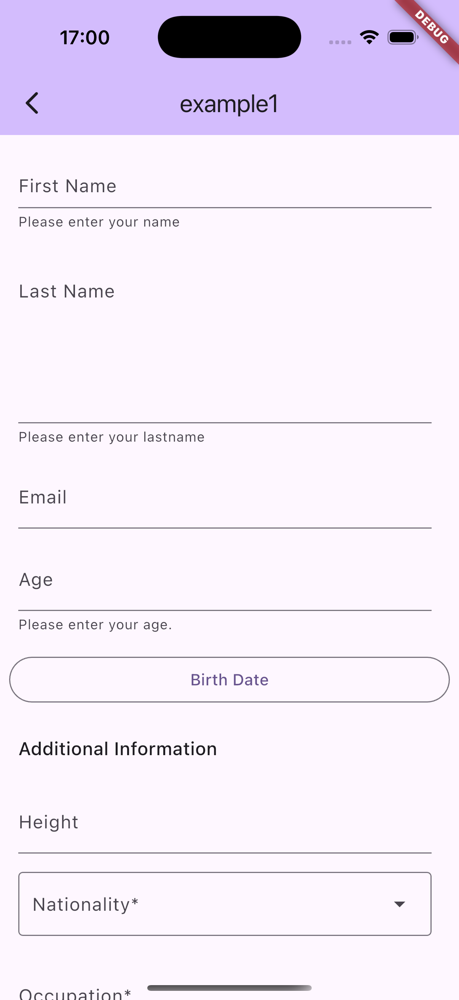

<?code-excerpt path-base="example"?>

# json_forms_renderer

[](https://pub.dev/packages/json_forms_renderer)
[](https://app.fossa.com/projects/git%2Bgithub.com%2Fpyck-ai%2Fjson-forms-renderer-flutter?ref=badge_shield)

A Flutter package to render forms from JSON Schema based on https://jsonforms.io and https://json-schema.org

## Usage

First, add `json_forms_renderer` as a dependency in your pubspec.yaml file.

```yaml
dependencies:
  json_forms_renderer: ^1.0.0
```

Don't forget to `flutter pub get`.

## Features Supported

See the example app for detailed implementation information.

| **Control**                      | **Type**        | **Supported** |
|----------------------------------|---------------|---------------|
| **Text**                         | string        | ✅             |
| **Textarea**                     | string        | ✅             |
| **RichText**                     | string        | ❌             |
| **Email**                        | string        | ❌             |
| **Select (Enum, single select)** | string        | ✅             |
| **Select (Enum, multi select)**  | string        | ❌             |
| **Number**                       | number        | ✅             |
| **Slider**                       | number        | ❌             |
| **Integer**                      | integer       | ✅             |
| **Checkbox**                     | boolean       | ✅             |
| **Toggle**                       | boolean       | ❌             |
| **Date**                         | string        | ✅             |
| **Time**                         | string        | ❌             |
| **Date&Time**                    | string        | ❌             |
| **DateRange**                    | range(date)   | ❌             |
| **SliderRange**                  | range(number) | ❌             |
| **Files**                        | file          | ❌             |

## Example

<?code-excerpt "lib/basic.dart (basic-example)"?>

```dart
import 'dart:convert';

import 'package:flutter/material.dart';
import 'package:http/http.dart' as http;
import 'package:json_forms/json_forms.dart';

class JsonFormPage extends StatefulWidget {
  const JsonFormPage({super.key});

  @override
  State<JsonFormPage> createState() => _JsonFormPageState();
}

class _JsonFormPageState extends State<JsonFormPage> {
  JsonForms? jsonForms;

  Map<String, dynamic> data = {};

  jsonFormUpdate(Map<String, dynamic> newData) {
    print(newData);
  }

  Future<void> getFormSchema() async {
    http.Response example1DataSchema = await http.get(
      Uri.parse(
        'https://raw.githubusercontent.com/pyck-ai/json-forms-examples/refs/heads/main/example1/dataSchema.json',
      ),
    );
    http.Response example1UiSchema = await http.get(
      Uri.parse(
        'https://raw.githubusercontent.com/pyck-ai/json-forms-examples/refs/heads/main/example1/uiSchema.json',
      ),
    );

    setState(() {
      jsonForms = JsonForms(
        json.decode(example1DataSchema.body),
        json.decode(example1UiSchema.body),
        data,
        jsonFormUpdate,
      );
    });
  }

  @override
  void initState() {
    super.initState();

    getFormSchema();
  }

  @override
  Widget build(BuildContext context) {
    return Scaffold(
      appBar: AppBar(
        backgroundColor: Theme.of(context).colorScheme.inversePrimary,
        title: Text("example1"),
      ),
      body:
      jsonForms != null
          ? jsonForms!.getWidget(context)
          : Center(child: CircularProgressIndicator()),
    );
  }
}

```

This example renders the following form based on the schema hosted here: https://github.com/pyck-ai/json-forms-examples/tree/main/example1

You can check out the example repository for more examples.




## License
[](https://app.fossa.com/projects/git%2Bgithub.com%2Fpyck-ai%2Fjson-forms-renderer-flutter?ref=badge_large)